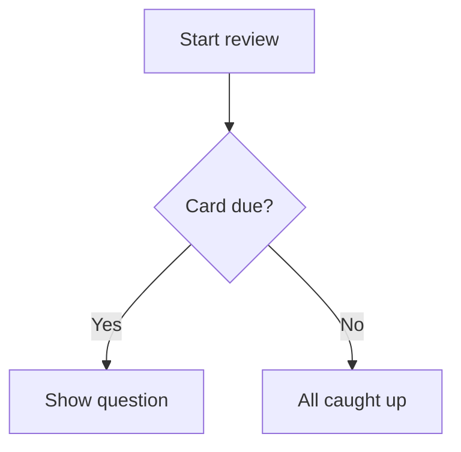

# Writing great cards {#writing-cards number="3"}

::: lede
A card is a question and an answer. Everything else is optional — and
that is where the fun starts. Under the plain text field sits a small,
friendly markup language: blanks to fill in, typeset maths, highlighted
code, diagrams, tables and words that are read aloud exactly the way you
want.
:::

::: inthischapter
- Find your way around the card editor
- Style text, add links and fill-in-the-blank cloze cards
- Put maths, code, diagrams and tables on a card
- Add pictures that look good in light *and* dark mode
- Tell the voice what to say — and learn the four places it listens
- Write cards your memory will actually keep
:::

## The card editor at a glance {#editor}

:::: split
{.phone}

::: text
Every card has two sides, **Question** and **Answer**, and each side is
edited on its own. A side has three tabs:

- **Text** — what you type, with the formatting toolbar above it.
- **Image** — one picture from Photos, the camera or a file.
- **Audio** — a recording or an audio file (`.mp3`, `.m4a`, `.wav`).

Below the text field you will find [Formatting help]{.ui} — a pocket
version of this chapter, always one tap away — and the side's
[Language]{.ui}.

A side can use any mix of text, picture and sound, but it can't be
empty: both the question and the answer need at least one of them before
[Save]{.ui} lights up.
:::
::::

### The toolbar

You never *have* to remember the markup. The toolbar above the text
field inserts it for you, wrapped around whatever you have selected. It
scrolls sideways; from left to right:

| Button | Inserts |
|---|---|
| Picture | the side's image, at the cursor |
| **B** / *I* | `**bold**` / `*italic*` |
| `</>` | `` `inline code` `` |
| *f(x)* / Σ | `$inline maths$` / a `$$` maths block |
| Waveform | `[shown]{spoken}` — a spoken hint |
| Cloze | `{{c1::…}}` — a fill-in-the-blank |
| Link | `[label](https://…)` |
| Table | a two-column table |
| Diagram | a `mermaid` diagram block |
| Large text | a `::: hero` block |

### Language matters

The [Language]{.ui} picker tells JustFlip! which voice should read that
side aloud, and each side has its own — a Spanish word on the front, its
English meaning on the back.

::: gotcha
#### No language, no voice

A new card starts with its language set to **None**, and a side with no
language is simply *not spoken* — not by the speaker button, not by
Speak Cards. If a card stays silent, check its language first.
:::

### Tags and flags

Tags are typed into a chip field: press Return, the **+** button or a
comma to turn the text into a tag. Paste `verbs, irregular, A2` and you
get three chips at once. Letter case doesn't matter and duplicates are
dropped. A colour flag makes a card stand out when you browse a deck.

## Text that looks right {#text}

Card text is Markdown, simplified for small screens. Here is everything
that shapes plain text:

:::: pair
```markdown
Mitochondria are the **powerhouse**
of the *cell*. The function is
`atp_synthase()`.
```

::: {.card side="answer"}
Mitochondria are the **powerhouse** of the *cell*. The function is
`atp_synthase()`.
:::
::::

- `**bold**` and `*italic*` — emphasis.
- `` `code` `` — a monospaced snippet.
- `\*` — a backslash shows the next character literally, so `\*not
  italic\*` keeps its stars.
- A **blank line** starts a new paragraph; a single line break is kept
  as it is.

::: note
#### What is deliberately missing

Cards are small, so a few Markdown habits don't apply. A line starting
with `# ` is shown as plain text — the hash marks are dropped, there are
no headings on a card. List markers such as `-` or `1.` appear exactly as
you typed them, which is usually what you want anyway.
:::

### Links

`[the guide](https://example.com)` shows *the guide* as a tappable link.
Web (`https://`), e-mail (`mailto:`) and phone (`tel:`) links work; any
other kind of link is shown as plain text.

## Fill in the blanks {#cloze}

A **cloze** card hides part of a sentence. The question shows a blank;
flipping the card reveals the missing words, highlighted. It is the
fastest way to turn a paragraph of notes into something you can be
tested on.

:::: pair
```markdown
The capital of France
is {{c1::Paris}}.
```

::: {.card side="question"}
The capital of France is [[…]]{.blank}.
:::
::::

Add a **hint** after a second pair of colons. The hint appears inside
the blank, and it is what the voice says instead of the word "blank":

:::: pair
```markdown
{{c1::Mitochondria::organelle}}
produce most of the cell's ATP.
```

::: {.card side="question"}
[[organelle]]{.blank} produce most of the cell's ATP.
:::
::::

When the card is flipped, the whole sentence comes back with the answers
marked — [Mitochondria]{.reveal} produce most of the cell's ATP. The
Answer side of a cloze card is optional. Anything you write there is shown
underneath the revealed sentence as extra notes.

::: gotcha
#### All blanks on a card hide together

Number your blanks `c1`, `c2`, `c3`… — but in JustFlip! every blank on
one card is hidden and revealed *at the same time*, and the card is
reviewed as a single item. Want to be tested on each blank separately?
Make one card per blank.

Anki users will know the other behaviour: there, each number becomes its
own card. That is exactly what happens when you **import** an Anki cloze
note — it is split into one card per number, so nothing you studied in
Anki is lost.
:::

A few details that save head-scratching:

- Only well-formed blanks count. `{{c0::x}}`, `{{c1::}}` or
  `{{not a cloze}}` are shown literally, braces and all.
- Need the braces themselves? Write `\{\{c1::…}}`.
- Inside code and maths, `{{c1::…}}` is left alone — it stays literal.

## Big and centred {#display}

Some cards are a single character: a kana, a kanji, a chemical symbol,
a chord name. Put it inside a **hero** block and it fills the card:

:::: pair
```markdown
::: hero
あ
:::
```

::: {.card side="question" .hero}
あ
:::
::::

`::: center` does the same without the size change — the content is
simply centred. Open the block with `::: hero` or `::: center` on its own
line and close it with `:::`.

::: tip
#### Let size be the emphasis

Keep any notes *outside* the block, so they stay regular text, and skip
bold or italic inside a hero block. At that size they only add noise.
:::

## Maths {#maths}

JustFlip! typesets maths with TeX syntax, the notation used by
mathematicians everywhere. Wrap a formula in single dollars to keep it in
the line, or put it between `$$` lines to give it its own centred row:

:::: pair
```markdown
The derivative:

$$
f'(x) = \lim_{h\to 0}\frac{f(x+h)-f(x)}{h}
$$
```

::: {.card side="answer"}
The derivative:

$$f'(x) = \lim_{h\to 0}\frac{f(x+h)-f(x)}{h}$$
:::
::::

{.shot width=78%}

Inline maths works the same way: `$E = mc^2$` becomes $E = mc^2$ right
inside the sentence. How to make a formula *sound* right when it is read
aloud comes in [Tell the voice what to say](#speech).

## Code {#code}

Fence code with three backticks and name the language after the opening
fence. JustFlip! colours keywords, strings, comments, numbers and types:

:::: pair
````markdown
```swift
let answer = 6 * 7
// prints 42
print(answer)
```
````

::: {.card side="answer"}
```swift
let answer = 6 * 7
// prints 42
print(answer)
```
:::
::::

Recognised language names: Swift, Python, JavaScript, TypeScript, Java,
Kotlin, C, C++, C#, Objective-C, Go, Rust, Ruby, PHP, SQL, Bash,
Smalltalk/Pharo, JSON and YAML. An unknown or missing name still gives
you a clean monospaced block — just without colours. Text inside a code
block is shown exactly as written; no markup is applied there.

## Diagrams {#diagrams}

A code block named `mermaid` isn't shown as code at all — JustFlip!
draws it. Flowcharts, sequence, state, class and entity-relationship
diagrams are all supported.

:::: pair
````markdown

````

{.card-shot}
::::

::: tip
#### Card-sized diagrams

Aim for about eight boxes with short labels. Start with `graph TD`
(top-down); JustFlip! may turn a flowchart on its side when that fits the
card better. For the details, the **Zoom** button opens the diagram full
screen.
:::

## Tables {#tables}

Small comparisons read best as a table. Leave a blank line above it; the
first row is the header and is shown in bold:

:::: pair
```markdown
| Tense | Form |
|---|---|
| Present | I go |
| Past | I went |
| Perfect | I have gone |
```

::: {.card side="answer"}
| Tense | Form |
|---|---|
| Present | I go |
| Past | I went |
| Perfect | I have gone |
:::
::::

Cells accept the same formatting as the rest of the card — bold, code,
maths. To show a `|` inside a cell, write `\|`.

::: gotcha
#### Two columns, five rows

A card table holds at most **2 columns and 5 rows**, header included.
Anything beyond that is left out and marked with an ellipsis. Alignment
colons such as `|:---|---:|` are accepted, but columns are always
left-aligned. A bigger table is usually a sign that the card wants to be
several cards.
:::

## Pictures {#pictures}

Each side of a card holds **one picture**. Add it on the Image tab, or
with the picture button in the text toolbar, which also inserts a marker
into the text:

```markdown
Which bird is this?

![attachment:0]
```

The marker, `![attachment:0]`, decides *where* the picture sits among the
text. A marker with no picture behind it simply shows nothing.

The picture has a **description** field, too. VoiceOver reads it to
people who can't see the image, so it is worth a few words.

::: gotcha
#### Transparent pictures vanish in dark mode

A card draws your picture exactly as it is, with no background behind
it. Black lines on a transparent background look perfect on a light card
and disappear completely on a dark one. Give diagrams, notation and
line art a solid white background before you add them.
:::

Use photos and bitmaps (PNG, JPEG). SVG files aren't supported. Keep files
reasonably small, too: JustFlip! warns you about anything over 10 MB,
because big files slow down iCloud sync on all your devices.

## Tell the voice what to say {#speech}

JustFlip! can read any card aloud, with the voice for that side's
language. Usually it gets things right. When it doesn't — an acronym, a
symbol, a formula — you can give it a **spoken hint**: curly braces
right after something tell the voice to say *this* instead.

:::: pair
```markdown
Enable [iOS]{eye oh ess}
background refresh.
```

::: {.card side="question" spoken="Enable eye oh ess background refresh."}
Enable iOS background refresh.
:::
::::

The card still shows *iOS*; the voice says "eye oh ess". The same rule
works in exactly four places:

| Where | You write |
|---|---|
| Any text, in brackets | `[C♯ minor]{C sharp minor}` |
| Inline maths | `$c^2${c squared}` |
| A maths block — after the closing `$$` | `$${V equals S p v}` |
| A picture | `![attachment:0]{a red apple}` |

Without a hint, text is read normally, maths is read out from its
source, and pictures are silent.

::: gotcha
#### Braces after anything else are shown

A hint only works in those four places. After bold, italic or bare
text, the braces are shown on the card:

- `*F♯ major*{F sharp major}` → the card shows *F♯ major*{F sharp major}
- `*[F♯ major]{F sharp major}*` → the card shows *F♯ major* and the
  voice says "F sharp major"

When in doubt, use brackets. Put any styling *outside* them.
:::

::: tip
#### Hints for what the voice gets wrong

Hints are for musical sharps and flats, formulas, abbreviations and
romanised syllables — things text-to-speech stumbles over. There is no
need to repeat what is already written. And for better voices overall,
download an Enhanced or Premium voice in the system settings, under
**Accessibility › Read & Speak › Voices**, then pick it in JustFlip!
under **Settings › Speech › Voices**.
:::

## When a card is too long {#fitting}

JustFlip! first tries to fit everything on the card. If the text doesn't
fit, it shrinks slightly, down to 80 % of the normal size. If it still
doesn't fit, the bottom fades out and a **•••** button appears — tap it to
read the full content.

That is a safety net, not a writing style. A card you can't read at a
glance is usually two or three cards pretending to be one.

## Cards your memory will keep {#good-cards}

Formatting makes a card pleasant. These habits make it *work*:

1. **One fact per card.** "What are the three branches of government?"
   is one card that fails half the time. Three cards, one per branch,
   each succeed on their own.
2. **Ask precisely.** A question that could have two right answers will
   teach you neither. Add context — or a cloze hint — until only one
   answer fits.
3. **Use your own words.** Rephrasing something is the first repetition,
   and it is free.
4. **Add a picture or a sound** whenever the thing *is* visual or
   audible: a bird, a chord, a pronunciation.
5. **Keep question texts unique within a deck.**

::: gotcha
#### Two cards, one question

When you import a deck file (Chapter 5), a card whose question text
matches a card already in that deck *updates* that card instead of
adding a new one. That makes re-importing a deck safe. But it also means
two cards with the very same question text — "Name this note.", say —
become one card. Put a shared prompt in the deck name instead, or leave
the question text empty on picture-only cards.
:::

## Cheat sheet {#cheat-sheet .cheatsheet}

| You write | You get |
|---|---|
| `**bold**` · `*italic*` | **bold** · *italic* |
| `` `code` `` | monospaced snippet |
| `\*` | a literal `*` |
| `[label](https://…)` | a link (`https`, `mailto`, `tel`) |
| `{{c1::answer}}` | a blank, revealed on the flip |
| `{{c1::answer::hint}}` | a blank that shows a hint |
| `::: hero` … `:::` | very large, centred content |
| `::: center` … `:::` | centred content |
| `$x^2$` | inline maths |
| `$$` … `$$` | a centred maths block |
| ```` ```swift ```` … ```` ``` ```` | highlighted code |
| ```` ```mermaid ```` … ```` ``` ```` | a diagram |
| `| A | B |` + `|---|---|` | a table, max 2 × 5 |
| `![attachment:0]` | the side's picture, here |
| `[shown]{spoken}` | say something else aloud |
| `$x^2${x squared}` | a spoken formula |
| `![attachment:0]{a red apple}` | a spoken picture |
